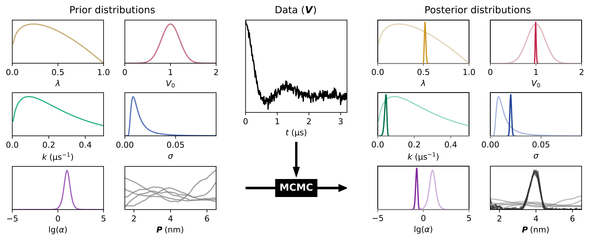

.. dive documentation master file, created by
   sphinx-quickstart on Wed Aug  7 19:00:32 2024.
   You can adapt this file completely to your liking, but it should at least
   contain the root `toctree` directive.

dive documentation
==================

dive is a Python package for Bayesian analysis of dipolar EPR (electron paramagnetic resonance) spectroscopy data through Markov chain Monte Carlo (MCMC) sampling with the Python package `PyMC <https://pymc.io>`_.

See :doc:`usage` for more information on how to use dive.

About
-----
``dive`` is a Python package for analyzing DEER spectroscopy with Bayesian 
inference. When given a model, prior distributions for each parameter (which are 
already included in dive), and experimental data, Markov chain Monte Carlo 
(MCMC) sampling is run with `PyMC` to yield refined posterior distributions for 
each parameter. These posterior distributions provide full quantification of 
the uncertainty of all parameters, and can be analyzed for their mean, 
confidence intervals, etc.

Contents
--------

.. toctree::
   
   usage
   data
   models
   sampling
   plotting
   saving
   utils
