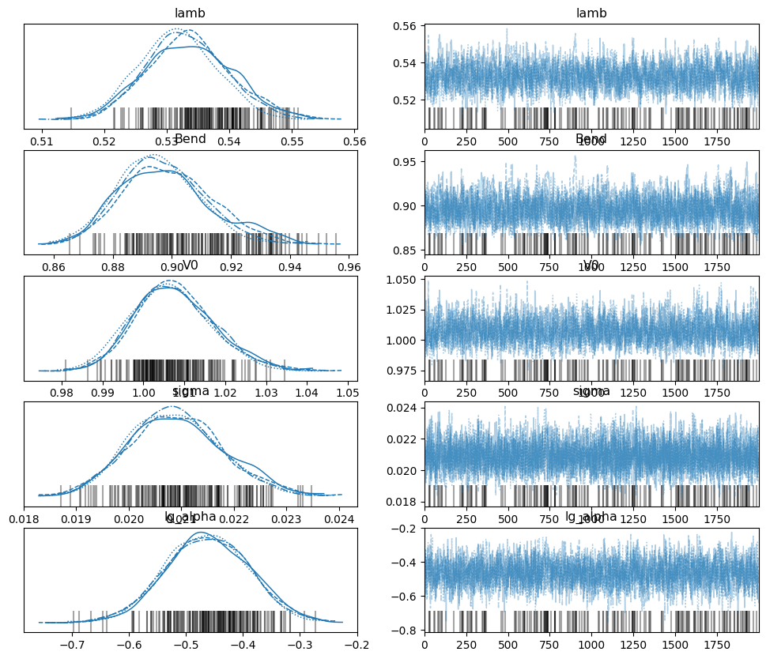
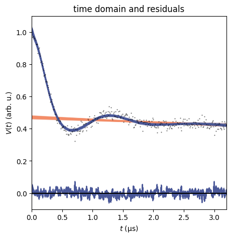
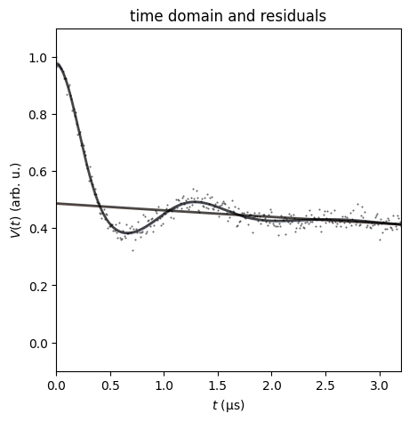
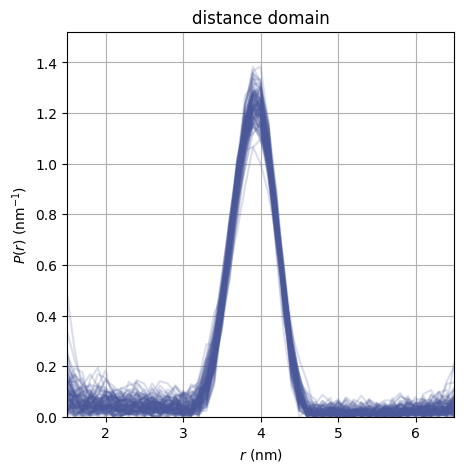
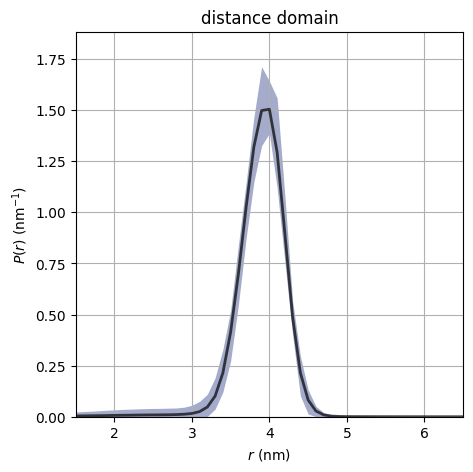
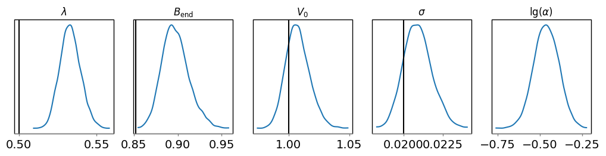
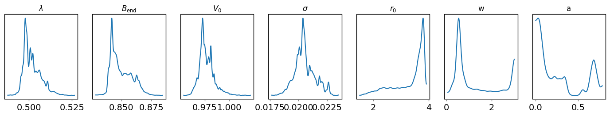
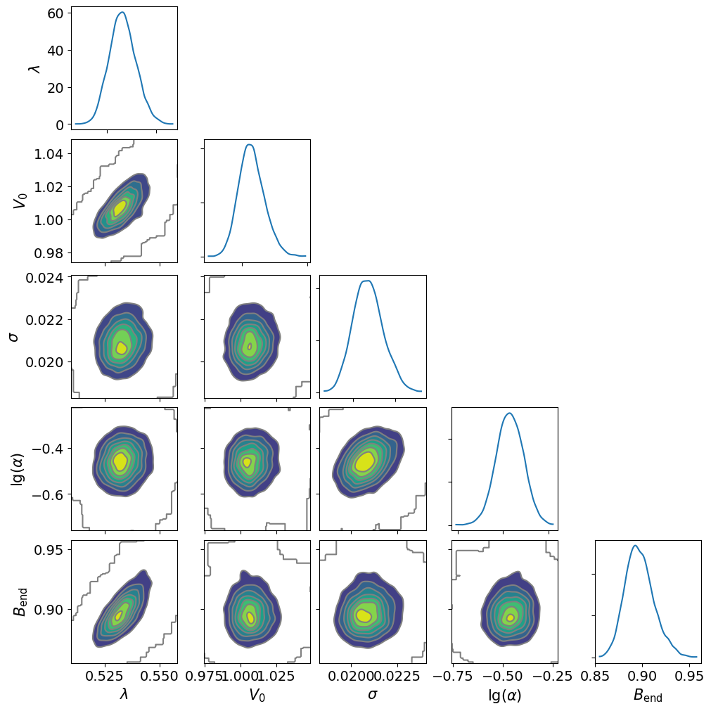
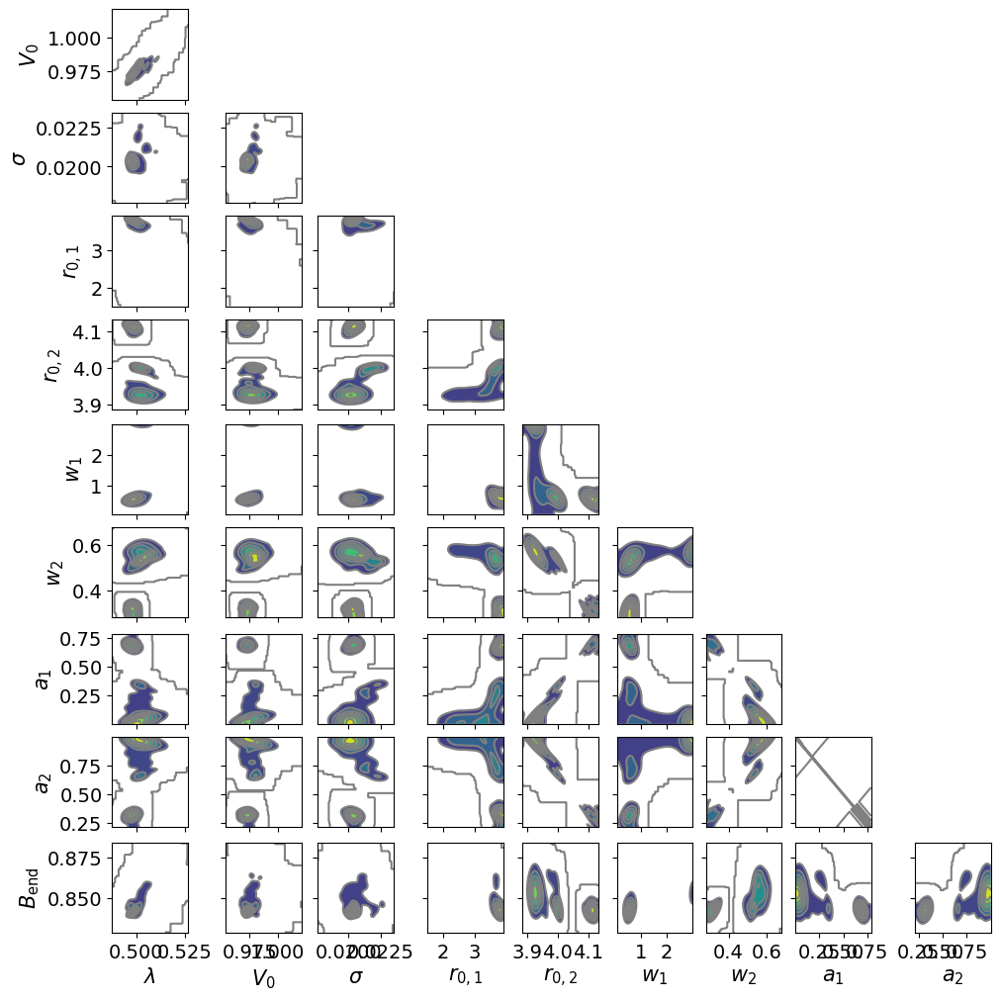

Usage
=====

Installation
------------

To install ``dive``, install it with pip. Please note that the package name is 
``dive-MCMC``:

.. code-block::

    pip install dive-MCMC

To use ``dive``, import it as usual:

.. code-block::

    import dive

You should also import important modules such as:

.. code-block::

    import pymc as pm
    import numpy as np
    import matplotlib.pyplot as plt
    import arviz as az
    import deerlab as dl
    from scipy.io import loadmat

Reading Data
------------

If you already have experimental traces that you wish to analyze, load them in 
as usual. Two example data files, ``3992_good.dat`` and ``3992_bad.dat``, are 
also included with ``dive`` in the ``/data`` folder.

For example,

.. code-block::

    # example data in /data
    loaded_data = np.genfromtxt(f"data/3992_good.dat", skip_header=1, delimiter=',')
    t = loaded_data[:,0]
    Vexp = loaded_data[:,1]

If you would instead like to create synthetic data, follow `this tutorial 
<https://jeschkelab.github.io/DeerLab/auto_examples/basic_simulations/ex_simulate_basic_4pdeer.html>`_ 
from DeerLab or use the built in functions at :doc:`data`.

Modeling
--------

Next, you should create for ``PyMC`` to run numerical sampling with 
``dive.model``. Detailed information can be found at :doc:`models`.

.. code-block::

    # a shorter rmax is recommended for better and faster sampling
    r = np.linspace(1.5, 6.5, 51)
    # non-parametric (Tikhonov regularization):
    model_tikh = dive.model(t, Vexp, method="regularization", r=r)
    # parametric (Gaussian mixture model):
    model_gauss = dive.model(t, Vexp, method="gaussian", n_gauss=2, r=r)

Sampling
--------

You can now sample the model with PyMC through ``dive.sample``. See 
:doc:`sampling` for more information.

.. code-block::

    # non-parametric
    trace_tikh = dive.sample(model_tikh, draws=2000, tune=1000, chains=4, random_seed=101)
    # parametric
    trace_gauss = dive.sample(model_gauss, draws=2000, tune=1000, chains=4, random_seed=101)

The output of ``dive.sample`` is an 
`ArviZ InferenceData object <https://python.arviz.org/en/latest/getting_started/XarrayforArviZ.html#xarray-for-arviz>`_.

Saving
------

The traces can be saved with ``dive.save_trace`` and ``dive.load_trace``. 
More information can be found at :doc:`saving`.

.. code-block::

    dive.save_trace(trace_tikh, "data/example_trace_tikh")
    dive.save_trace(trace_gauss, "data/example_trace_gauss")

.. code-block::

    trace_tikh, model_tikh = dive.load_trace("data/example_trace_tikh.nc")
    trace_gauss, model_gauss = dive.load_trace("data/example_trace_gauss.nc")

Validating
----------

Before moving on to data analysis, it is important to make sure that the chains 
are stable and converged. Below are a few functions that are helpful in 
assessing chain convergence and quality:

``dive.print_summary(trace)``: This prints a data table containing information 
about the marginalized parameter distributions, including their mean, 
94% confidence interval, skewness, etc. For validating our results, however, 
we are most interested in the rightmost column titled ``r_hat``.

``r_hat`` is the ratio of interchain variance to intrachain variance. 
If it is close to 1, then the variances are similar, meaning that the chains 
have converged to similar regions.

``r_hat`` values below 1.05 suggest good convergence, and it is encouraged 
that the ``r_hat`` for every variable in ``dive.print_summary`` should be below 
this value before you continue to analysis. (If you are just testing things out, 
it is okay, though not ideal, to have higher values of ``r_hat``.)

Documentation can be found in :doc:`plotting`.

.. code-block::

    dive.print_summary(trace_tikh)
    dive.print_summary(trace_gauss)

.. code-block::

                        mean 	sd 	    hdi_3% 	hdi_97% mcse_mean 	mcse_sd ess_bulk 	ess_tail 	r_hat
    $λ$ 	            0.533 	0.007 	0.521 	0.546 	0.000 	    0.000 	1040.0 	    1656.0 	    1.01
    $V_0$ 	            1.007 	0.010 	0.990 	1.026 	0.000 	    0.000 	1819.0 	    3126.0 	    1.00
    $σ$ 	            0.021 	0.001 	0.019 	0.023 	0.000 	    0.000 	4447.0 	    3908.0 	    1.00
    $\mathrm{lg}(α)$ 	-0.462 	0.074 	-0.597 	-0.322 	0.002 	    0.001 	2225.0 	    3735.0 	    1.00
    $B_\mathrm{end}$ 	0.897 	0.015 	0.872 	0.929 	0.000 	    0.000 	1390.0 	    970.0 	    1.01
                        mean 	sd 	hdi_3% 	hdi_97% 	mcse_mean 	mcse_sd ess_bulk 	ess_tail 	r_hat
    $λ$ 	            0.502 	0.005 	0.495 	0.512 	0.001 	    0.001 	16.0 	    70.0 	    1.19
    $V_0$ 	            0.977 	0.007 	0.963 	0.991 	0.001 	    0.001 	33.0 	    191.0 	    1.14
    $σ$ 	            0.021 	0.001 	0.019 	0.022 	0.000 	    0.000 	12.0 	    21.0 	    1.39
    $r_{0,1}$ 	        3.337 	0.571 	2.156 	3.849 	0.185 	    0.142 	7.0 	    123.0 	    1.56
    $r_{0,2}$ 	        3.989 	0.076 	3.911 	4.123 	0.037 	    0.028 	5.0 	    16.0 	    2.03
    $w_1$ 	            1.157 	0.908 	0.348 	2.998 	0.265 	    0.192 	16.0 	    128.0 	    1.32
    $w_2$ 	            0.494 	0.108 	0.282 	0.603 	0.052 	    0.040 	6.0 	    14.0 	    1.77
    $a_1$ 	            0.264 	0.259 	0.001 	0.708 	0.126 	    0.097 	6.0 	    51.0 	    1.91
    $a_2$ 	            0.736 	0.259 	0.292 	0.999 	0.126 	    0.096 	6.0 	    49.0 	    1.91
    $B_\mathrm{end}$ 	0.850 	0.009 	0.839 	0.866 	0.002 	    0.002 	14.0 	    134.0 	    1.21

``az.plot_trace(trace)``: This helpful function from the ``arviz`` library makes 
two plots for each parameter. On the left, it plots the marginalized posterior 
of the parameter for each chain (if you set ``combined`` to ``False``). This is 
very helpful in visualizing convergence. If you see one (or more) chains with a 
significantly different posterior plot, it is like unconverged. On the right, 
it plots the value of the parameter chronologically for each chain. 
If you notice that it gets 'stuck' (showing the same value for many draws in a 
row), it may be sampling poorly.

See `the documentation <https://python.arviz.org/en/stable/api/generated/arviz.plot_trace.html>`_ for az.plot_trace.

.. code-block::

    # non-parametric trace is converged:
    az.plot_trace(trace_tikh, var_names=["lamb","Bend","V0","sigma","lg_alpha"], combined=False)
    # parametric trace is not converged
    az.plot_trace(trace_gauss, var_names=["lamb","Bend","V0","sigma","r0","w","a"], combined=False)

It can be seen that the non-parametric trace is well-converged, while the 
parametric trace is not. This is probably because the sampler does not know 
where to put the second gaussian in the parametric trace, as shown by the large 
uncertainties in its mean (``r0``), width (``w``), and amplitude (``a``) on the 
arviz plot. Changing the model to be a 1-gaussian model would likely help with 
convergence.

**Question: My chains aren't converged! What should I do?**

**Answer:** Try the following steps:

1. **Increase the number of draws**. Most often, you just need to run your trace 
for longer to attain convergence.

2. **Increase the number of tunes**. Proper tuning is important to good 
sampling, and increasing the number of tuning steps may help, though anything 
above 2000 tunes per chain probably will not be too helpful.

3. **Adjust your model**. For example, shortening the maximum value of the 
r-axis will lead to faster sampling and convergence. You may also want to 
consider changing the number of gaussians (if using a parametric model) and 
changing the resolution of the r-axis.

4. **Prune chain(s)**. If you notice that one (or more) chains are particularly 
unconverged, but the rest are decent, then you could remove the faulty chain(s). 
You can do this through ``dive.prune_chains(trace)``, which drops each chain one 
by one and pruning the one that reduces ``r_hat`` the most, repeating until 
converged. You can also remove chains with 
``trace.sel(chain=desired_chain_numbers)``. Note that pruning chains will not be 
very effective if all of your chains are very different from each other.

5. **Set alpha to a fixed value**. This can be done by passing an ``alpha`` 
parameter in ``dive.model()``. Removing a parameter may make for better 
sampling. However, fixing a parameter will also limit the validity of the 
uncertainty analysis, so do this with caution.

Accessing Results
-----------------

The output of ``dive.sample`` is an `ArviZ InferenceData object <https://python.arviz.org/en/latest/getting_started/XarrayforArviZ.html#xarray-for-arviz>`_ 
that consists of three xarray objects: ``posterior``, ``sample_stats``, and 
``observed_data``.

We are primarily interested in ``trace.posterior``, which is an xarray object 
containing all of our parameters as data variables, the chains and draws as 
coordinates, and some supplementary information as attributes.

.. code-block::

    print(trace_tikh.posterior)

.. code-block::

    <xarray.Dataset> Size: 7MB
    Dimensions:            (chain: 4, draw: 2000, P_dim_0: 51, P_Dirichlet_dim_0: 51)
    Coordinates:
    * chain              (chain) int64 32B 0 1 2 3
    * draw               (draw) int64 16kB 0 1 2 3 4 ... 1995 1996 1997 1998 1999
    * P_Dirichlet_dim_0  (P_Dirichlet_dim_0) int64 408B 0 1 2 3 4 ... 47 48 49 50
    * P_dim_0            (P_dim_0) float64 408B 1.5 1.6 1.7 1.8 ... 6.3 6.4 6.5
    Data variables:
        Bend               (chain, draw) float64 64kB 0.8891 0.8917 ... 0.8683
        P                  (chain, draw, P_dim_0) float64 3MB ...
        P_Dirichlet        (chain, draw, P_Dirichlet_dim_0) float64 3MB ...
        V0                 (chain, draw) float64 64kB 1.003 0.9967 ... 1.003 1.01
        delta              (chain, draw) float64 64kB ...
        k                  (chain, draw) float64 64kB ...
        lamb               (chain, draw) float64 64kB 0.5271 0.5239 ... 0.5251
        lg_alpha           (chain, draw) float64 64kB -0.4515 -0.4756 ... -0.6419
        lg_delta           (chain, draw) float64 64kB ...
        sigma              (chain, draw) float64 64kB 0.01939 0.02025 ... 0.02026
        tau                (chain, draw) float64 64kB ...
    Attributes: (12/14)
        created_at:                 2024-08-06T20:39:37.362330+00:00
        arviz_version:              0.18.0
        inference_library:          pymc
        inference_library_version:  5.10.4
        sampling_time:              519.4337060451508
        tuning_steps:               1000
        ...                         ...
        include_background:         1
        include_mod_depth:          1
        include_amplitude:          1
        delta_prior:                [1.e+00 1.e-06]
        tau_prior:                  [1.e+00 1.e-04]
        random_seed:                101

The array stores the values for each parameter in the order they were generated, 
so if we wanted to find the value of ``lamb`` for the first draw of the first 
chain, we would print:

.. code-block::

    print(trace_tikh.posterior.lamb[0][0])

.. code-block::

    <xarray.DataArray 'lamb' ()> Size: 8B
    array(0.527104)
    Coordinates:
        chain    int64 8B 0
        draw     int64 8B 0

Oftentimes, however, this is not a very convenient way to access the posterior 
distributions. Instead, we can use the function `az.extract <https://python.arviz.org/en/latest/api/generated/arviz.extract.html#arviz.extract>`_, 
which allows us to extract the parameters we want and stack them to combine the 
``chain`` and ``draw`` dimensions.

.. code-block::

    import arviz as az
    lamb_array = az.extract(trace_tikh, var_names=["lamb"]) # extracts all the value of lambda for all samples and stacks them
    print(lamb_array.values) #.values converts the xarray into a numpy array

.. code-block::

    [0.52710417 0.52392079 0.53517045 ... 0.53273982 0.53126788 0.52509982]

With an xarray/numpy array of your parameters, you can perform your data 
analysis as usual. ArviZ may also have useful functions for data analysis, 
including `az.hdi <https://python.arviz.org/en/stable/api/generated/arviz.hdi.html>`_, 
which calculates the highest density interval (the equivalent of a confidence 
interval) for some parameter.

.. code-block::

    lamb_hdi = az.hdi(trace_tikh, hdi_prob=0.95, var_names=["lamb"]) # calculates the 95% highest density interval for lambda
    print(lamb_hdi)

.. code-block::

    <xarray.Dataset> Size: 64B
    Dimensions:  (hdi: 2)
    Coordinates:
    * hdi      (hdi) <U6 48B 'lower' 'higher'
    Data variables:
        lamb     (hdi) float64 16B 0.5202 0.5457

More information about InferenceData objects can be found `here <https://python.arviz.org/en/latest/getting_started/WorkingWithInferenceData.html>`_.

Plotting
--------

``dive`` provides several useful plots for assessing fit and investigating 
marginalized posterior distributions. Please see :doc:`plotting` for full 
documentation. A few funcitons are outlined below:

``dive.plot_V`` plots an ensemble of modelled signals to the true signal, 
along with residuals and a corresponding ensemble of background fits.

.. code-block::

    dive.plot_V(trace_tikh)
    dive.plot_V(trace_gauss,show_avg=True,hdi=0.95)

``dive.plot_P`` plots an ensemble of distance distributions to give a 
visualization of the uncertainty of P.

.. code-block::

    dive.plot_P(trace_tikh)
    dive.plot_P(trace_gauss,show_avg=True,hdi=0.95,alpha=0.5)

For the marginal posteriors of the other parameters, you can call 
``dive.plot_marginals`` for 1D marginalized distributions and 
``dive.plot_correlations`` for 2D marginalized distributions.

.. code-block::

    dive.plot_marginals(trace_tikh, var_names=["lamb","Bend","V0","sigma","lg_alpha"], ground_truth={"lamb":0.5,"Bend":np.exp(-0.05*3.2),"V0":1,"sigma":0.02})
    dive.plot_marginals(trace_gauss, var_names=["lamb","Bend","V0","sigma","r0","w","a"]) # spiky/uneven plots due to poor convergence

.. code-block::

    dive.plot_correlations(trace_tikh)
    dive.plot_correlations(trace_gauss,marginals=False)

